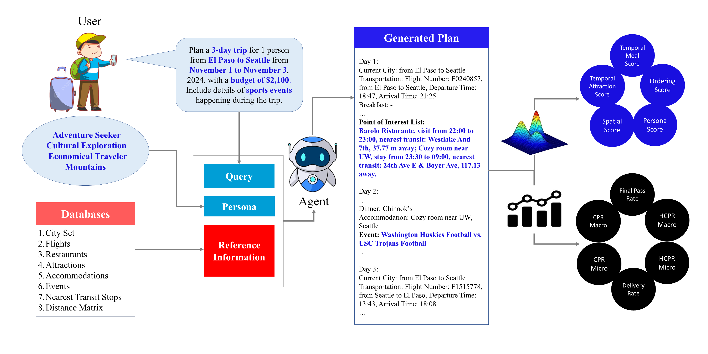

<div align="center">
<h1 align="center">🧙‍♀️TripCraft🌍: A Benchmark for Spatio-Temporally Fine Grained Travel Planning【ACL'25 (Main)】</h1>

<p align="center">
  <a href="https://arxiv.org/abs/2502.20508">
    
  </a>
</p>


<p align="center">
     <br>
</p>

This is the official implementation of **TripCraft**, a new benchmark for LLM driven personalized travel planning, offering a more realistic, constraint aware framework for itinerary generation.
</div>

<p align="center">
[<a href="https://arxiv.org/abs/2502.20508">Paper</a>] •
[<a>Dataset_to_be_updated</a>] 
</p>

## 📢 News

- 2025/05/16: 🎉 Our **TripCraft** has been accepted to the Main Track of ACL 2025.

# 🧭 TripCraft Overview

We introduce TripCraft, a spatiotemporally coherent travel planning dataset that integrates real world constraints, including public transit schedules, event availability, diverse attraction categories, and user personas for enhanced personalization. To evaluate LLM generated plans beyond existing binary validation methods, we propose five continuous evaluation metrics, namely Temporal Meal Score, Temporal Attraction Score, Spatial Score, Ordering Score, and Persona Score which assess itinerary quality across multiple dimensions. 

## 🐍 Setup Environment
Ensure that minconda/anaconda is installed in your system beforehand.
1. Check whether conda is installed using:
```bash
conda --version
```
2. Emulate Tripcraft's conda environment and install dependencies:
```bash
conda env create -f tpct_env.yml -n tripcraft
conda activate
```

2. Download the [database](link_yet_to_be_updated) and unzip it to the `TripCraft` directory (i.e., `your/path/TripCraft`).

## 🚀 Running
TripCraft offers experimentation in two settings: w/o parameter information and with parameter information mode. Change the run.sh file accordingly for both the settings.
Please refer to the paper for more details.

```bash
bash run.sh
```
*Note:* All Experiments were run on a single NVIDIA L40 GPU setup.

## 🛠️ Postprocess

We leverage GPT-4o to convert natural language output plans into structured JSON representations, following TravelPlanner's postprocessing [scripts](https://github.com/OSU-NLP-Group/TravelPlanner?tab=readme-ov-file#postprocess). We also perform consistency checks to ensure that the corresponding elements of the natural language plan were mapped properly to their JSON fields, thereby minimizing the mismatch introduced by LLM-based postprocessing. We encourage researchers and developers to explore alternative LLMs or prompt engineering strategies to further enhance the robustness and accuracy of the plan-to-JSON conversion process.

Prior to evaluation, the output at this stage is expected to match the format provided in [sample_evaluation_format](https://github.com/Soumyabrata2003/TripCraft/blob/main/postprocess/sample_evaluation_format.jsonl).

<a name="testing"></a>
## ⚡ Evaluation

Qualitative Metrics (Continuous)
```sh
cd evaluation
python qualitative_metrics.py --gen_file <generated_output_json_file> --anno_file <annotation_json_file>
```
Feasibility Metrics (Discrete)

```sh
# set_type: 3d/5d/7d
cd evaluation
python eval.py --set_type <SET_TYPE> --evaluation_file_path <EVALUATION_FILE_PATH>
```

<a name="bibtex"></a>
## 📌 BibTeX & Citation

If you use our code in your research or wish to refer to the baseline results, please use the following BibTeX entry😁.


```bibtex
@article{chaudhuri2025tripcraft,
  title={Tripcraft: A benchmark for spatio-temporally fine grained travel planning},
  author={Chaudhuri, Soumyabrata and Purkar, Pranav and Raghav, Ritwik and Mallick, Shubhojit and Gupta, Manish and Jana, Abhik and Ghosh, Shreya},
  journal={arXiv preprint arXiv:2502.20508},
  year={2025}
```


<a name="acknowledgment"></a>
## 🎗️ Acknowledgement

This repository is partially built based on [TravelPlanner](https://github.com/OSU-NLP-Group/TravelPlanner?tab=readme-ov-file). Sincere thanks to their wonderful work.


## 👫 Contact
For any question, please file an issue.
